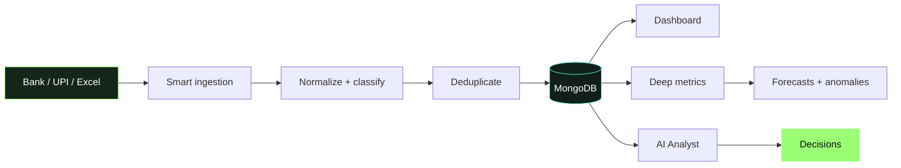
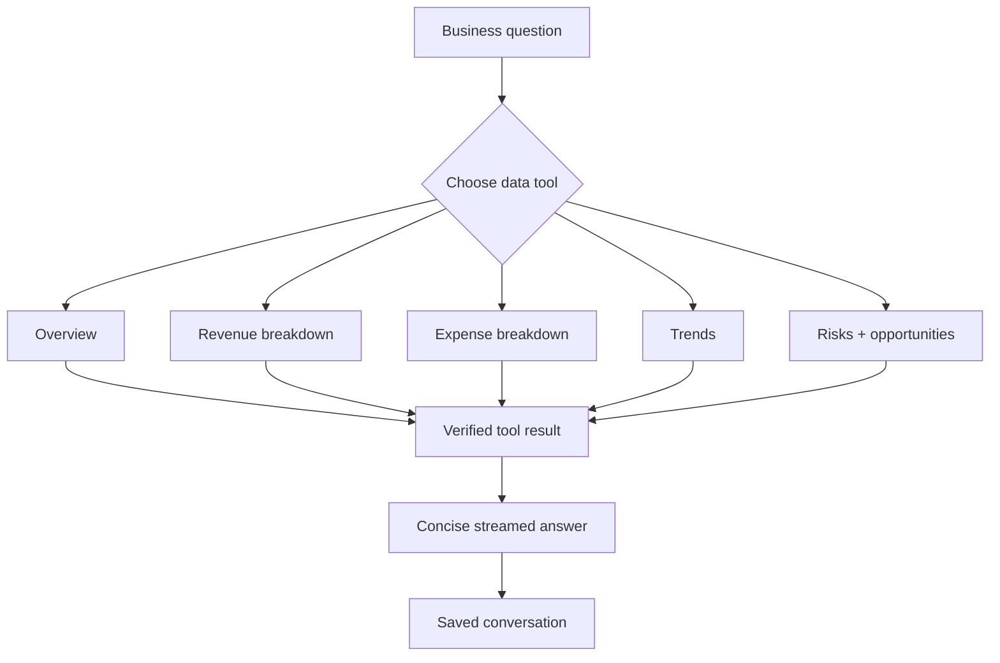

# Metrivo

<p align="center">
  
</p>

<p align="center">
  <a href="#quick-start">Quick start</a> ·
  <a href="./CODEBASE_OVERVIEW.md">Architecture</a> ·
  <a href="#the-analyst">The Analyst</a> ·
  <a href="./SECURITY.md">Security</a>
</p>

## Platform at a glance



## The Analyst

The Analyst is a data-grounded business assistant—not a free-form chatbot.



## Technology

<p align="left">
  
  
  
  
</p>

<p align="left">
  
  
  
  
</p>

---


## Quick start

```bash
npm install

cd backend
python3 -m venv .venv
.venv/bin/pip install -r requirements.txt
cd ..

cp .env.example .env
docker compose up -d mongo
```

Run the services in separate terminals:

```bash
npm run analytics   # FastAPI :8000
npm run dev         # Next.js :3000
```

Then open [http://localhost:3000](http://localhost:3000).
