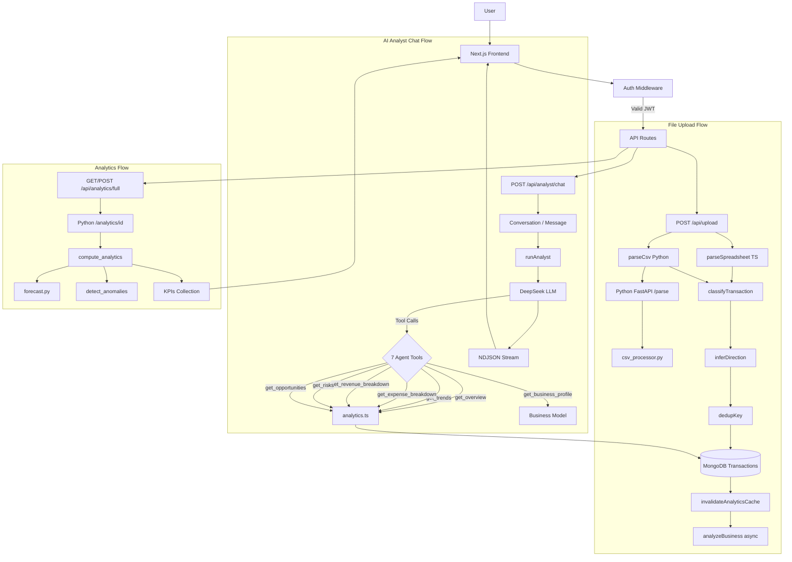
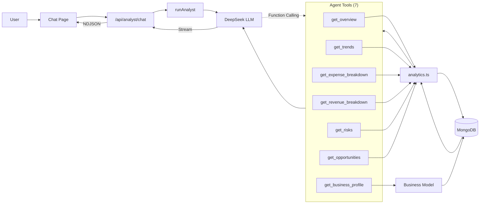

# Metrivo Project Analysis

This document provides a technical overview of the Metrivo application, covering its architecture, components, workflows, routing, agent communication, state handling, implementation status, and current architectural limitations.

## Table of Contents

- [A. Architecture Summary](#a-architecture-summary)
- [B. Component Map](#b-component-map)
- [C. Workflow Diagram](#c-workflow-diagram)
- [D. Routing Flow](#d-routing-flow)
- [E. Agent Communication Diagram](#e-agent-communication-diagram)
- [F. State Flow](#f-state-flow)
- [G. Implementation Status](#g-implementation-status)
- [H. Critical Issues](#h-critical-issues)
- [Summary](#summary)

---

# A. Architecture Summary

The current Metrivo architecture connects the web application, API layer, MongoDB database, Python analytics service, and DeepSeek-based analyst.

```text
User
  |
  v
Next.js Frontend (App Router)
  |
  v
API Routes
(Auth, Upload, Analytics, Chat)
  |
  +----------------------+
  |                      |
  v                      v
MongoDB              Python FastAPI
(Mongoose)            Analytics / Forecast / Anomalies
  |
  v
DeepSeek LLM
(Tool Calling)
  |
  v
Agent Tools
  |
  v
Analytics Engine
```

## Technology Stack

| Layer | Technology |
|---|---|
| Frontend | Next.js 14 (App Router) + TypeScript + Tailwind |
| Database | MongoDB (Mongoose in Next.js, pymongo in Python) |
| Analytics Service | Python FastAPI (numpy/pandas), running on port 8000 |
| AI Analyst | DeepSeek `deepseek-chat` with OpenRouter/NVIDIA fallback and tool calling |
| Authentication | JWT stored in cookies using HS256 with 7-day expiry |

---

# B. Component Map

| Component | File | Function / Class | Responsibility |
|---|---|---|---|
| Auth | `src/lib/auth.ts` | `requireUser()`, `getSession()`, `signToken()` | Handles JWT verification and session management |
| Middleware | `src/middleware.ts` | `middleware()` | Protects application routes and redirects unauthenticated users |
| DB Connection | `src/lib/db.ts` | `connectDb()` | Manages the Mongoose database connection pool |
| Models | `src/lib/models.ts` | `User`, `Business`, `Transaction`, `FileModel`, `Conversation`, `Message` | Defines the Mongoose data schemas |
| Upload | `src/app/api/upload/route.ts` | `POST()` | Processes CSV/XLSX files, classifies transactions, removes duplicates, and inserts records |
| Python Parse | `src/lib/python.ts` | `parseCsv()` | Sends CSV parsing requests to the Python `/parse` endpoint |
| Parse (TS) | `src/lib/parse.ts` | `parseSpreadsheet()` | Provides the XLSX parsing fallback and column detection |
| CSV Processor | `backend/app/csv_processor.py` | `process_csv()` | Performs chunked CSV processing with pandas and detects columns automatically |
| Classify | `src/lib/classify.ts` | `classifyTransaction()` | Determines transaction category and subcategory using regex rules |
| Direction | `src/lib/direction.ts` | `inferDirection()` | Determines credit or debit direction from description, type, and amount |
| Dedupe | `src/lib/preprocess.ts` | `dedupKey()` | Generates an MD5-based key for duplicate detection |
| Analytics (TS) | `src/lib/analytics.ts` | `monthlyTotals()`, `getOverview()`, `getRisks()`, `getOpportunities()` | Performs MongoDB aggregations for dashboard analytics |
| Analytics (Py) | `backend/app/analytics.py` | `compute_analytics()` | Performs the complete 9-domain analytics process together with forecasting and anomaly detection |
| Forecast | `backend/app/forecast.py` | `forecast()`, `detect_anomalies()` | Provides Linear, Holt, Holt-Winters forecasting and z-score anomaly detection |
| API Bridge | `src/lib/python.ts` | `getAnalytics()`, `analyzeBusiness()` | Provides communication between Next.js and the Python FastAPI service |
| Agent | `src/lib/agent.ts` | `runAnalyst()` | Runs the DeepSeek tool-calling analyst with seven available tools |
| Chat API | `src/app/api/analyst/chat/route.ts` | `POST()` | Handles streaming analyst conversations and persists conversation data |
| Reclassify | `src/lib/reclassify.ts` | `reclassifyBusiness()` | Recalculates transaction directions across a business |

---

# C. Workflow Diagram

The following diagram represents the three main processing paths currently present in Metrivo:

- File upload
- AI analyst chat
- Analytics processing



> The visual label `Python /analytics/id` is used in the Mermaid diagram to avoid GitHub Mermaid parsing issues with `{id}`. The documented API behavior remains unchanged.

---

# D. Routing Flow

## Request Classification

The middleware layer processes incoming requests before they reach protected application areas.

- `src/middleware.ts:8-30` handles request interception.
- The following application paths are protected:
  - `/dashboard`
  - `/metrics`
  - `/upload`
  - `/transactions`
  - `/chat`
  - `/onboarding`
- JWT validation is performed through the `jose` library.
- Invalid authentication results in a redirect to `/login`.

## API Route Selection

| Route | Handler | Purpose |
|---|---|---|
| `/api/auth/*` | `src/app/api/auth/*/route.ts` | Registration, login, logout, and current-user operations |
| `/api/businesses` | `src/app/api/businesses/route.ts` | Business profile CRUD operations |
| `/api/businesses/inputs` | `src/app/api/businesses/inputs/route.ts` | Updates financial input data |
| `/api/upload` | `src/app/api/upload/route.ts` | Handles file upload and transaction parsing |
| `/api/files` | `src/app/api/files/route.ts` | Lists and deletes uploaded files |
| `/api/transactions` | `src/app/api/transactions/route.ts` | Retrieves and deletes transactions |
| `/api/transactions/reclassify` | `src/app/api/transactions/reclassify/route.ts` | Recalculates transaction directions |
| `/api/analytics/overview` | `src/app/api/analytics/overview/route.ts` | Returns dashboard KPIs, risks, and opportunities |
| `/api/analytics/trends` | `src/app/api/analytics/trends/route.ts` | Provides monthly trends for twelve months |
| `/api/analytics/breakdown` | `src/app/api/analytics/breakdown/route.ts` | Provides transaction category breakdowns |
| `/api/analytics/full` | `src/app/api/analytics/full/route.ts` | Requests complete analytics from Python |
| `/api/analyst/chat` | `src/app/api/analyst/chat/route.ts` | Provides streaming AI analyst conversations |
| `/api/conversations` | `src/app/api/conversations/route.ts` | Creates, lists, and deletes conversations |

## Workflow Selection

### Upload

The preferred upload path is:

```text
CSV
 |
 v
Python pandas
 |
 v
Transaction Processing
```

If the Python parser is not used, the TypeScript `xlsx` parser acts as the fallback.

### Analytics

Two analytics paths are available:

```text
Dashboard Requests
      |
      v
TypeScript Aggregations
(analytics.ts)
```

and:

```text
Full Analytics Request
      |
      v
Python compute_analytics()
      |
      +-- 9 Analytics Domains
      +-- Forecast
      +-- Anomaly Detection
```

### Chat

The analyst uses DeepSeek together with seven fixed tools. Tool selection is determined by the LLM through function calling.

## Agent and Tool Selection

The current agent implementation has the following characteristics:

- Seven tools are hardcoded in `src/lib/agent.ts:77-132`.
- The LLM determines which tools should be called using function calling.
- There is no dynamic agent routing.
- Only one `Analyst` agent currently exists.
- Tool execution occurs sequentially.
- The `runAnalyst` loop supports a maximum of six iterations.

## Parallel Execution

There is currently no parallel execution between multiple agents.

The existing execution model is:

```text
One Chat Request
      |
      v
One Analyst Agent
      |
      v
Sequential Tool Calls
```

Some API routes use `Promise.all`, including operations such as overview, risks, and opportunities.

Python analytics processes its analytics domains sequentially.

---

# E. Agent Communication Diagram

The AI analyst communicates with the LLM through tool calls. The tools then access the application's analytics and business data.



## Communication Mechanisms

| Mechanism | Usage |
|---|---|
| Direct function calls | Communication between the Analyst agent and its tools within the TypeScript process |
| Shared MongoDB | Shared access to transactions, businesses, and conversations |
| HTTP API | Communication between Next.js and Python FastAPI for analytics, parsing, and forecasting |
| NDJSON streaming | Streaming analyst responses through `ReadableStream` |
| In-memory state | Recent conversation context, with the last 12 messages passed to the LLM |

---

# F. State Flow

The application currently uses request-level execution rather than a persistent workflow state model.

| State Type | Storage | Flow |
|---|---|---|
| Workflow State | None (stateless API) | Every request executes independently |
| Agent State | In-memory per request | `runAnalyst` maintains the messages array and tool calls for up to six iterations |
| Persistent DB State | MongoDB collections: `users`, `businesses`, `transactions`, `files`, `conversations`, `messages`, `kpis` | Application services read and update persistent records |
| Conversation Memory | `conversations` and `messages` collections | The most recent 12 messages are loaded for each chat |
| Vector/RAG Memory | Not implemented | There are no embeddings or vector database |
| Cache/Queue State | `kpis` collection | `invalidateAnalyticsCache()` removes cached analytics during upload/reclassification, while Python updates the cache through `/analyze` |

## State Transitions

### Upload

```text
Upload
  |
  v
Transactions Inserted
  |
  v
kpis Deleted
  |
  v
Python analyzeBusiness() Async
  |
  v
kpis Upserted
```

### Chat

```text
Chat Request
  |
  v
Conversation Created / Loaded
  |
  v
Messages Appended
  |
  v
Response Streamed
  |
  v
Assistant Message Saved
```

### Reclassification

```text
Reclassify
  |
  v
Transactions Updated
  |
  v
kpis Deleted
  |
  v
Python analyzeBusiness() Async
```

---

# G. Implementation Status

| Feature | Status | Evidence |
|---|---|---|
| User Auth (JWT) | Implemented | `src/lib/auth.ts`, `src/middleware.ts` |
| Business Onboarding | Implemented | `/api/businesses` CRUD |
| File Upload (CSV/XLSX) | Implemented | `/api/upload`, `parse.ts`, `csv_processor.py` |
| Column Auto-detection | Implemented | `csv_processor.py:55-73`, `parse.ts:158-187` |
| Direction Inference | Implemented | `direction.ts`, `csv_processor.py:116-139` |
| Category Classification | Implemented | `classify.ts:7-53` |
| Deduplication | Implemented | `preprocess.ts:33-47`, `upload/route.ts:85-160` |
| Dashboard Analytics | Implemented | `analytics.ts`, `/api/analytics/overview` |
| Full 9-Domain Analytics | Implemented | `backend/app/analytics.py:105-279` |
| Forecasting (3 methods) | Implemented | `backend/app/forecast.py:8-68` |
| Anomaly Detection | Implemented | `backend/app/forecast.py:71-94` |
| AI Analyst Chat | Implemented | `agent.ts:174-296`, `/api/analyst/chat` |
| Tool Calling (7 tools) | Implemented | `agent.ts:77-132` |
| Streaming Response | Implemented | `agent.ts:257-271`, `chat/page.tsx:134-158` |
| Conversation History | Implemented | `/api/conversations`, `models.ts:125-160` |
| Financial Inputs | Implemented | `/api/businesses/inputs`, `models.ts:32` |
| Reclassify Directions | Implemented | `reclassify.ts`, `/api/transactions/reclassify` |
| File Deletion | Implemented | `/api/files/[id]`, `/api/transactions` DELETE |
| Vector/RAG | Missing | No embeddings or vector search |
| Multi-agent Orchestration | Missing | Single agent only |
| Workflow Engine | Missing | No DAG or task dependencies |
| HITL/Approval | Missing | No pause/resume or approval gates |
| Queue/Worker | Missing | Async processing uses `catch(() => {})` fire-and-forget |
| Retry/Error Handling | Partial | Basic try/catch, but no exponential backoff |
| Rate Limiting | Missing | No API rate limiting |

---

# H. Critical Issues

## 1. No Workflow or Orchestration Engine

### Evidence

There are currently no workflow definitions, task DAGs, or state machines. API routes operate independently.

### Impact

The existing architecture cannot directly represent a multi-stage process such as:

```text
Upload
  |
  v
Parse
  |
  v
Classify
  |
  v
Review
  |
  v
Approve
  |
  v
Analyze
```

### Relevant Files

The API routes operate independently and there is no dedicated orchestrator.

---

## 2. Fire-and-Forget Asynchronous Processing

### Evidence

`upload/route.ts:199` invokes:

```typescript
analyzeBusiness(businessId).catch(() => {})
```

The error is therefore discarded instead of being surfaced to a monitoring or retry mechanism.

### Impact

If analytics recomputation fails:

- The failure may not be visible.
- There is no retry mechanism.
- There is no monitoring mechanism.

### Relevant Files

```text
src/app/api/upload/route.ts:199
src/app/api/transactions/reclassify/route.ts:18
```

---

## 3. Single Agent With No Multi-Agent Support

### Evidence

`agent.ts` currently exports `runAnalyst`. Its tools are hardcoded and there is no agent registry or delegation mechanism.

### Impact

The current implementation cannot decompose more complex requests such as:

```text
forecast + risk analysis + benchmark
```

into separate specialized agents.

### Relevant Files

```text
src/lib/agent.ts:174-296
```

---

## 4. No Vector Search or RAG

### Evidence

There is no embedding generation, vector database, or semantic retrieval implementation in the current codebase.

### Impact

The analyst cannot retrieve broader historical context beyond the recent conversation messages.

The current implementation only loads the last 12 messages.

### Relevant Files

```text
src/lib/agent.ts:201-205
```

---

## 5. Python Service Tight Coupling and Missing Health Checks

### Evidence

`python.ts:3` contains a hardcoded `localhost:8000` service endpoint.

Additionally, `getAnalytics` can return `null` when the Python service fails.

### Impact

If the Python service becomes unavailable:

- Full analytics can fail silently.
- There is no circuit breaker.
- There is no fallback to the TypeScript analytics implementation.

### Relevant Files

```text
src/lib/python.ts:5-17
src/app/api/analytics/full/route.ts:19-22
```

---

# Summary

Metrivo is currently a single-user financial analytics application that includes an AI-powered chat analyst. Its implementation provides a complete data ingestion path, analytics capabilities, forecasting, anomaly detection, and tool-based AI interaction.

The current implementation includes:

- A transaction ingestion pipeline covering upload, parsing, classification, deduplication, and storage.
- Two analytics implementations, with TypeScript handling dashboard-oriented calculations and Python handling the more comprehensive analytics workload.
- An evidence-based AI analyst that can use predefined tools.
- Persistent conversation and business data through MongoDB.

The following capabilities are not currently implemented:

- Workflow engine
- Multi-agent architecture
- Vector/RAG system
- Queue and worker infrastructure
- Human-in-the-loop approval

The resulting architecture is based on request-response processing combined with fire-and-forget asynchronous execution rather than persistent, orchestrated workflows.
